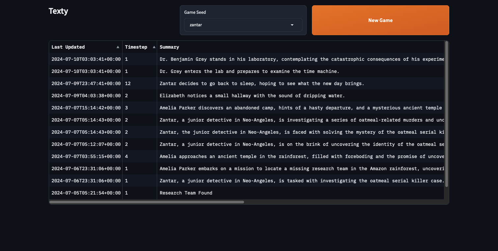
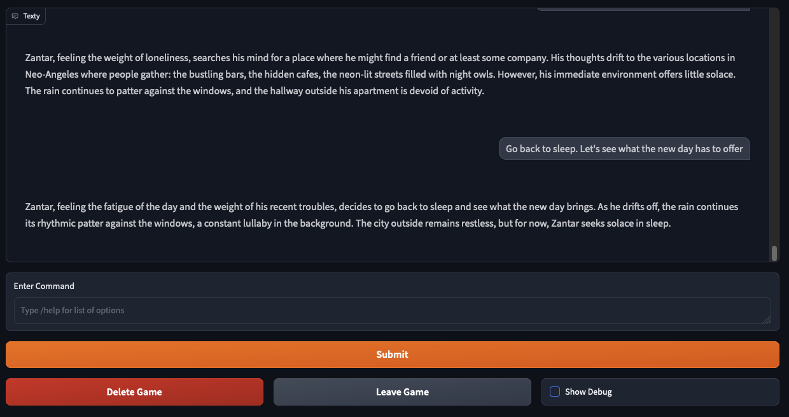

# texty

texty is a text adventure/choose your own adventure story simulator. It has a framework designed to assist the LLM in keeping a consistent and engaging gameworld. System-prompt only implementations of text adventures tend towards directionless meanderings. Alongside the game log, texty updates a world state that keeps track of story elements (characters, places, and many others), and the LLM updates this plan document alongside responding to the player.

This is very much a work in progress prototype. The goal is to make a system that compromises between open world sandbox, and directed stories. 

- The bad: the game currently has some pretty rough edges like buggy repetitive responses. It's also not yet very imaginative with on the fly concepts, and not very good at giving other characters inner life.
- The good: it does seem to direct, on its own, the player along its game structures, extrapolating a bit, and not getting too lost.

Future plans: I'd like to explore better automatic pre-writing and refining the game object data structures to help make the game richer and have better momentum. Additionally, I'd like to introduce chance of failure as a concept (and evaluate the failure with a random number generator)--otherwise the LLM is usually too easily swayed by the players input, making the game world too dreamy.

# Run it

It currently runs on gradio.

To get up and running

First install `poetry`, then

```sh
poetry install
```

Fill in relevent credentials in a `.env` file in this directory:

```sh
ANTHROPIC_API_KEY=sk...
LLM_MODEL_LARGE="anthropic/claude-3-5-sonnet-20240620"
LLM_MODEL_SMALL="anthropic/claude-3-5-sonnet-20240620"
# openai is also supported. You can override the base url, and specify a json parsing mode
# OPENAI_API_KEY = sk...
# OPENAI_TOOL_MODE=true # or OPENAI_JSON_MODE
# llama.cpp
# OPENAI_URI = "http://localhost:8080/v1" # llama.cpp
# LLM_MODEL_LARGE = "openai/Meta-Llama-3-70B-Q4_K_M"
# LLM_MODEL_SMALL="openai/Meta-Llama-3-70B-Q4_K_M"
# LLAMA_CPP_JSON_SCHEMA=true # use llama.cpp grammar
```

Then run the gradio server

```sh
poetry run gradio texty/web.py
```

Files are stored in this directory in texty.db

## Screenshots




