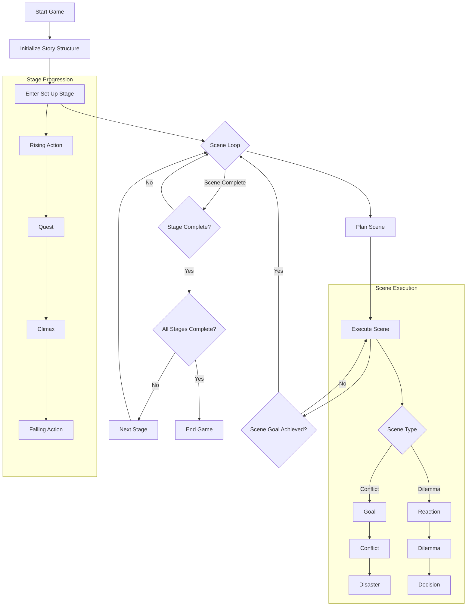

```mermaid
graph TD
    A[Start Game] --> B[Initialize Story Structure]
    B --> C[Enter Set Up Stage]
    C --> D{Scene Loop}
    D -->|Scene Complete| E{Stage Complete?}
    E -->|No| D
    E -->|Yes| F{All Stages Complete?}
    F -->|No| G[Next Stage]
    G --> D
    F -->|Yes| H[End Game]
    
    D --> I[Plan Scene]
    I --> J[Execute Scene]
    J --> K{Scene Goal Achieved?}
    K -->|No| J
    K -->|Yes| D

    subgraph "Scene Execution"
        J --> L{Scene Type}
        L -->|Conflict| M[Goal]
        M --> N[Conflict]
        N --> O[Disaster]
        L -->|Dilemma| P[Reaction]
        P --> Q[Dilemma]
        Q --> R[Decision]
    end

    subgraph "Stage Progression"
        C --> S[Rising Action]
        S --> T[Quest]
        T --> U[Climax]
        U --> V[Falling Action]
    end
```
    